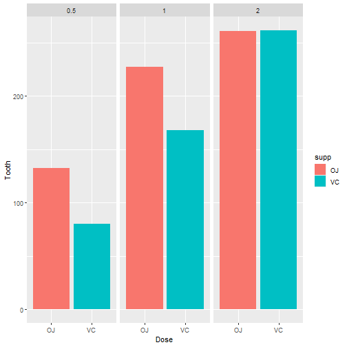

##  Load the ToothGrowth data and perform some basic exploratory data analyses

```r
data(ToothGrowth)
data <- ToothGrowth
head(data)
```

```
##    len supp dose
## 1  4.2   VC  0.5
## 2 11.5   VC  0.5
## 3  7.3   VC  0.5
## 4  5.8   VC  0.5
## 5  6.4   VC  0.5
## 6 10.0   VC  0.5
```

```r
dim(data)
```

```
## [1] 60  3
```

##  Provide a basic summary of the data.

```r
summary(data)
```

```
##       len        supp         dose      
##  Min.   : 4.20   OJ:30   Min.   :0.500  
##  1st Qu.:13.07   VC:30   1st Qu.:0.500  
##  Median :19.25           Median :1.000  
##  Mean   :18.81           Mean   :1.167  
##  3rd Qu.:25.27           3rd Qu.:2.000  
##  Max.   :33.90           Max.   :2.000
```

```r
library(ggplot2)
ggplot(data, aes(x= supp, y = len, fill=supp)) + geom_bar(stat="identity")+labs(x= "Dose", y="Tooth") +  facet_grid(. ~ dose)
```



##  Use confidence intervals and/or hypothesis tests to compare tooth growth by supp and dose. (Only use the techniques from class, even if there's other approaches worth considering)

Hypothesis Tests for length 0.5

```r
OJ_supp_05  = ToothGrowth$len[ToothGrowth$supp== 'OJ' & ToothGrowth$dose==0.5]
VC_supp_05  = ToothGrowth$len[ToothGrowth$supp== 'VC' & ToothGrowth$dose==0.5]

t.test(OJ_supp_05, VC_supp_05, alternative = "greater", paired = FALSE)
```

```
## 
## 	Welch Two Sample t-test
## 
## data:  OJ_supp_05 and VC_supp_05
## t = 3.1697, df = 14.969, p-value = 0.003179
## alternative hypothesis: true difference in means is greater than 0
## 95 percent confidence interval:
##  2.34604     Inf
## sample estimates:
## mean of x mean of y 
##     13.23      7.98
```

Hypothesis Tests for length 1.0

```r
OJ_supp_10  = ToothGrowth$len[ToothGrowth$supp== 'OJ' & ToothGrowth$dose==1.0]
VC_supp_10  = ToothGrowth$len[ToothGrowth$supp== 'VC' & ToothGrowth$dose==1.0]

t.test(OJ_supp_10, VC_supp_10, alternative = "greater", paired = FALSE)
```

```
## 
## 	Welch Two Sample t-test
## 
## data:  OJ_supp_10 and VC_supp_10
## t = 4.0328, df = 15.358, p-value = 0.0005192
## alternative hypothesis: true difference in means is greater than 0
## 95 percent confidence interval:
##  3.356158      Inf
## sample estimates:
## mean of x mean of y 
##     22.70     16.77
```


Hypothesis Tests for length 2.0

```r
OJ_supp_20  = ToothGrowth$len[ToothGrowth$supp== 'OJ' & ToothGrowth$dose==2.0]
VC_supp_20  = ToothGrowth$len[ToothGrowth$supp== 'VC' & ToothGrowth$dose==2.0]

t.test(OJ_supp_20, VC_supp_20, alternative = "greater", paired = FALSE)
```

```
## 
## 	Welch Two Sample t-test
## 
## data:  OJ_supp_20 and VC_supp_20
## t = -0.046136, df = 14.04, p-value = 0.5181
## alternative hypothesis: true difference in means is greater than 0
## 95 percent confidence interval:
##  -3.1335     Inf
## sample estimates:
## mean of x mean of y 
##     26.06     26.14
```

##  State your conclusions and the assumptions needed for your conclusions.
In general, OJ provides higher tooth growth then VC.
Increase rate of dose and tooth growth are proportional.
