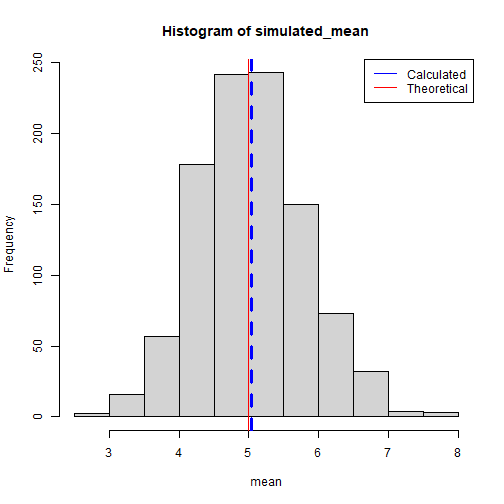
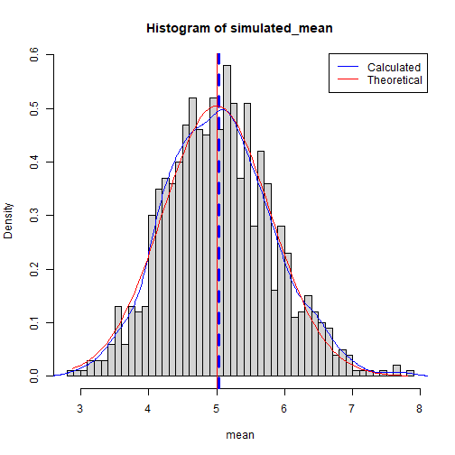
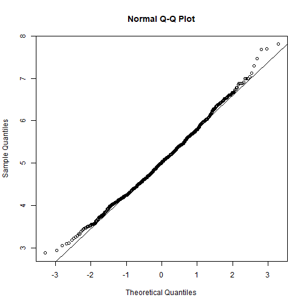

## Overview

In this project you will investigate the exponential distribution in R and compare it with the Central Limit Theorem. We will set lambda equal to 0.2 and 40 simulation and compare calculated values of distribution and theoretical distribution. Through this experiment, we will answer this following questions:

- 1. Show the sample mean and compare it to the theoretical mean of the distribution.
- 2. Show how variable the sample is (via variance) and compare it to the theoretical variance of the distribution.
- 3. Show that the distribution is approximately normal.


# Simulations


```r
lambda = 0.2
#distribution of averages of 40 exponentials
n <-40
#distribution of 1000 random uniforms
random <- 1000

simulated <- matrix(rexp(n*random, rate =lambda),n, random)
simulated_mean <- apply(simulated, 2, FUN=mean)
```


## Sample Mean versus Theoretical Mean

Show the sample mean and compare it to the theoretical mean of the distribution.


```r
sample_mean <-mean(simulated_mean)
print(sample_mean)
```

```
## [1] 5.036816
```

```r
theoretical_mean <-1/lambda
print(theoretical_mean)
```

```
## [1] 5
```

```r
hist(simulated_mean, xlab="mean", ylab="Frequency")
abline(v=sample_mean, col="blue", lwd=3, lty=2)
abline(v=theoretical_mean, col="red")

legend("topright", c("Calculated", "Theoretical"), col =c("blue", "red"), lty=1)
```



    
## Sample Variance versus Theoretical Variance

Show how variable the sample is (via variance) and compare it to the theoretical variance of the distribution.

```r
std_sample <- sd(simulated_mean)
variance_sample <- std_sample^2

sd_theory <-(1/lambda)/(sqrt(n))
variance_theory <- sd_theory^2
```
The square root of the variance is standard deviation.

Calculated standard deviation is 0.7987513 and Theoritical standard deviation is 0.6380036.

Calculated variance of the distribution is 0.7905694 and Theoritical variance of the distribution is 0.625 


## Distribution  

Show that the distribution is approximately normal.

```r
hist(simulated_mean,breaks=n,prob=TRUE, xlab="mean", ylab="Density")

abline(v=sample_mean, col="blue", lwd=3, lty=2)
abline(v=theoretical_mean, col="red")

xfit <- seq(min(simulated_mean), max(simulated_mean), length=100)
yfit <- dnorm(xfit, mean = 1/lambda, sd = (1/lambda)/sqrt(n))
lines(density(simulated_mean), col="blue")
lines(xfit, yfit,pch=22, col="red")

legend("topright", c("Calculated", "Theoretical"), col =c("blue", "red"), lty=1)
```



Difference between the distribution of a large collection of random exponentials and the distribution of a large collection of averages of 40 exponentials.

```r
qqnorm(simulated_mean)
qqline(simulated_mean)
```



Based on this figure and due to central limit theorem (CLT), the distribution of averages of 40 exponentials is close to normal distribution.
